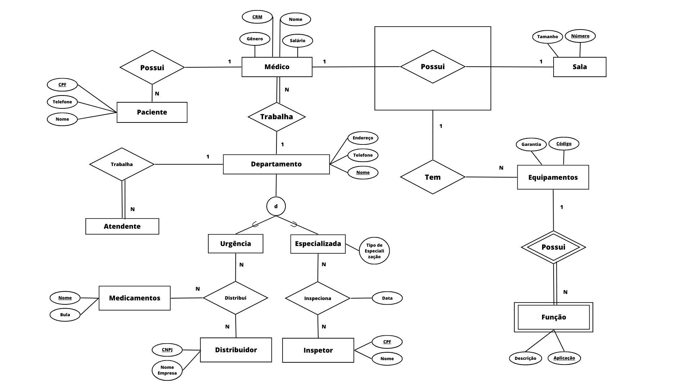

# Sistema Hospitalar - Base de Dados

Bem-vindo à documentação da Base de Dados do Sistema Hospitalar. Este repositório contém informações essenciais sobre a estrutura, utilização e manutenção da base de dados do nosso sistema hospitalar.

## Minimundo

O sistema de gerenciamento hospitalar é projetado para otimizar e coordenar as atividades em um ambiente médico, promovendo um atendimento eficiente e de qualidade aos pacientes. Ele engloba diversos elementos e relacionamentos que descrevem as interações entre as entidades envolvidas.

## Entidades e Relacionamentos

Entidades Principais:

*Médico*: Profissional de saúde responsável por diagnosticar, tratar e acompanhar os pacientes. Cada médico pode estar associado a vários pacientes, trabalhar em um departamento específico e possuir uma sala com equipamentos para suas atividades.

*Paciente*: Indivíduo que busca assistência médica. Cada paciente é atendido por um médico específico e pode receber medicamentos prescritos durante o tratamento.

*Sala*: Espaço físico onde os médicos realizam consultas e procedimentos. Cada médico pode ter uma sala associada para suas atividades.

*Atendente*: Profissional responsável por auxiliar na recepção e no agendamento de consultas. Os atendentes trabalham em departamentos específicos.

*Departamento*: Dividido em duas categorias: Urgência e Especializada. Os médicos e atendentes são alocados em departamentos, cada um com suas características e funções distintas.

*Distribuidor*: Entidade responsável por fornecer medicamentos para a ala de Urgência, garantindo um suprimento constante e adequado.

*Inspetor*: Profissional encarregado de inspecionar a ala Especializada, garantindo a qualidade dos serviços e dos equipamentos.

*Medicamentos*: Produtos farmacêuticos prescritos pelos médicos aos pacientes durante o tratamento.

*Equipamentos*: Recursos médicos necessários para a realização de procedimentos e exames. Cada sala pode possuir diversos equipamentos com funções específicas.

*Função*: Descrição da utilidade de cada equipamento, indicando para quais procedimentos ele é utilizado.

Relacionamentos:
- Um médico possui vários pacientes ao longo do tempo, cuidando de suas condições de saúde.
- Cada médico pode estar associado a uma sala onde realiza consultas e procedimentos.
-  médico é designado para trabalhar em um departamento, que pode ser de Urgência ou Especializada.
- Os atendentes também são alocados em departamentos, auxiliando no agendamento e na recepção.
-  ala de Urgência é abastecida por um distribuidor, que fornece medicamentos conforme necessário.
-  ala Especializada é inspecionada por um inspetor para garantir a qualidade dos serviços e dos equipamentos.
- Cada sala pode possuir diversos equipamentos, cada um com uma função específica.

## Diagrama de Entidade-Relacionamento

A seguir está o diagrama que ilustra visualmente as entidades e relacionamentos da base de dados:

## Modelo Lógico

